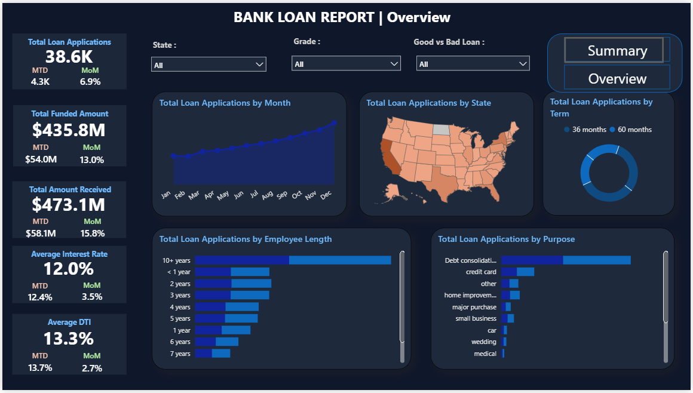
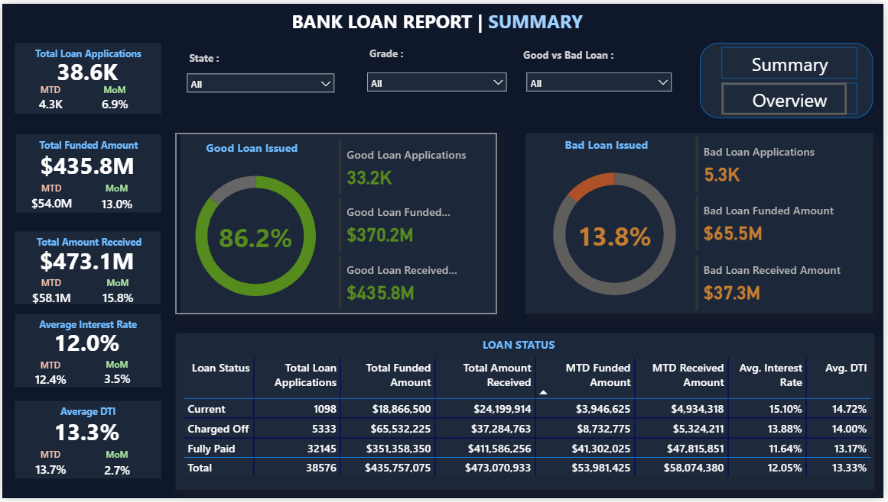

# 🏦 Bank Loan Report | Power BI Dashboard

An interactive two-page Power BI dashboard analyzing bank loan data — covering application trends, loan quality, funding amounts, and borrower demographics.

---

## 🖼️ Dashboard Preview

### Page 1 – Summary


### Page 2 – Overview


---

## 📁 Repository Structure

```
bank-loan-dashboard/
├── README.md
├── bank_loan_report.pbix        ← Power BI report file
├── data/
│   └── financial_loan.csv       ← Source dataset
├── images/
│   ├── summary.png              ← Summary page screenshot
│   └── overview.png             ← Overview page screenshot
└── sql/
    ├── 00_setup.sql             ← CREATE DATABASE / TABLE, LOAD DATA, sanity check
    ├── 01_kpi_summary.sql       ← Headline KPIs, MTD, MoM % (CTE + CASE WHEN)
    ├── 02_loan_quality_breakdown.sql  ← Good/Bad split, Loan Status table, Grade breakdown
    ├── 03_geographic_performance.sql  ← State-level performance (choropleth source)
    ├── 04_top_n_ranking.sql     ← Purpose / Emp Length / Term rankings (ROW_NUMBER CTE)
    └── 05_monthly_trend.sql     ← Monthly trend + MoM % (CASE WHEN CTE + LAG)
```

---

## 📌 Dashboard Pages

### 1. Bank Loan Report | Summary
High-level KPIs and loan quality breakdown.

| KPI | Value |
|---|---|
| Total Loan Applications | 38.6K (MTD: 4.3K, MoM: 6.9%) |
| Total Funded Amount | $435.8M (MTD: $54.0M, MoM: 13.0%) |
| Total Amount Received | $473.1M (MTD: $58.1M, MoM: 15.8%) |
| Average Interest Rate | 12.0% (MTD: 12.4%, MoM: 3.5%) |
| Average DTI | 13.3% (MTD: 13.7%, MoM: 2.7%) |

**Good vs Bad Loan Split:**
- ✅ **Good Loans:** 86.2% → 33.2K applications, $370.2M funded, $435.8M received
- ❌ **Bad Loans:** 13.8% → 5.3K applications, $65.5M funded, $37.3M received

**Loan Status Table:** Current, Charged Off, Fully Paid — with Funded Amount, Amount Received, MTD figures, Avg. Interest Rate, and Avg. DTI

**Filters:** State, Grade, Good vs Bad Loan

---

### 2. Bank Loan Report | Overview
Trend and distribution analysis across multiple dimensions.

- **By Month:** Loan applications trend line (Jan–Dec) showing steady growth peaking in Dec
- **By State:** US choropleth map highlighting high-volume states (California leads)
- **By Term:** Donut chart — 36 months vs 60 months split
- **By Employee Length:** Bar chart — 10+ years borrowers are the largest segment
- **By Purpose:** Bar chart — Debt consolidation is the top reason, followed by credit card and other

**Filters:** State, Grade, Good vs Bad Loan

---

## 📂 Dataset

| Field | Description |
|---|---|
| `loan_status` | Current / Charged Off / Fully Paid |
| `application_type` | Individual or joint application |
| `loan_amount` | Requested loan amount (USD) |
| `funded_amount` | Amount actually funded (USD) |
| `total_payment` | Total amount received from borrower |
| `interest_rate` | Annual interest rate (%) |
| `dti` | Debt-to-income ratio |
| `grade` | Loan grade assigned (A–G) |
| `purpose` | Reason for loan (debt consolidation, credit card, etc.) |
| `emp_length` | Borrower's employment length |
| `addr_state` | Borrower's state |
| `issue_d` | Loan issue date |

---

## 🗄️ SQL Queries

The `sql/` folder contains MySQL scripts that recreate every metric visible in the dashboard.  
These exist to make the analytical work transparent and searchable — the same logic lives inside the `.pbix` as DAX measures.

| File | Description | Key SQL Technique |
|---|---|---|
| [`00_setup.sql`](sql/00_setup.sql) | Create database & table; load CSV with date conversion | `LOAD DATA LOCAL INFILE`, `STR_TO_DATE` |
| [`01_kpi_summary.sql`](sql/01_kpi_summary.sql) | Headline KPIs, MTD values, MoM % change | CTE + `CASE WHEN` pivot |
| [`02_loan_quality_breakdown.sql`](sql/02_loan_quality_breakdown.sql) | Good/Bad loan split, Loan Status table, Grade breakdown | Conditional aggregation (`SUM CASE WHEN`) |
| [`03_geographic_performance.sql`](sql/03_geographic_performance.sql) | State-level applications, funded amount, bad-loan rate | Grouped aggregation, `HAVING`, subquery |
| [`04_top_n_ranking.sql`](sql/04_top_n_ranking.sql) | Purpose, Employment Length, and Term rankings | `ROW_NUMBER()` window function in CTE |
| [`05_monthly_trend.sql`](sql/05_monthly_trend.sql) | Monthly trend, MoM %, quarterly rollup | `CASE WHEN` CTE + `LAG()` window function |

### KPI Verification vs Dashboard

| Metric | SQL Formula | Dashboard Value | Status |
|---|---|---|---|
| Total Loan Applications | `COUNT(*)` | 38.6 K | ✅ Match |
| Total Funded Amount | `SUM(loan_amount)` | $435.8 M | ✅ Match |
| Total Amount Received | `SUM(total_payment)` | $473.1 M | ✅ Match |
| Average Interest Rate | `AVG(int_rate) * 100` | 12.0 % | ✅ Match — rate stored as decimal (0.12), multiply × 100 |
| Average DTI | `AVG(dti) * 100` | 13.3 % | ✅ Match — DTI stored as decimal (0.133), multiply × 100 |
| Good Loan % | `SUM(status IN ('Fully Paid','Current')) / COUNT(*) * 100` | 86.2 % | ✅ Match |
| Bad Loan % | `SUM(status = 'Charged Off') / COUNT(*) * 100` | 13.8 % | ✅ Match |
| MTD values | Filter `YEAR = 2021 AND MONTH = 12` | e.g. 4.3 K apps | ⚠️ Hardcoded Dec 2021 — Power BI uses dynamic `DATESMTD(TODAY())` |
| MoM % | `(current - previous) / previous * 100` via `LAG()` | e.g. 6.9 % | ✅ Arithmetic match — DAX uses `PARALLELPERIOD`, SQL uses `LAG()`, same result |

### Running the Scripts in MySQL Workbench

1. **Enable local file loading** — run once per session before `00_setup.sql`:
   ```sql
   SET GLOBAL local_infile = 1;
   ```
   Or launch MySQL Workbench / the CLI with the `--local-infile=1` flag.

2. **Update the file path** in `00_setup.sql` (line ~60):
   ```sql
   LOAD DATA LOCAL INFILE 'C:/your/path/to/data/financial_loan.csv'
   ```

3. **Run in order** — open each file in Workbench and execute with `Ctrl+Shift+Enter`:
   ```
   00_setup.sql  →  01_kpi_summary.sql  →  02 … 03 … 04 … 05
   ```

4. **Verify** — the sanity-check query at the bottom of `00_setup.sql` should return:
   `total_applications = 38,576 | funded_m = 435.8 | received_m = 473.1`

---

## 🛠️ Tools Used

| Tool | Purpose |
|---|---|
| Power BI Desktop | Dashboard design & DAX measures |
| MySQL | SQL query development & KPI validation |
| CSV | Source data |
| DAX | KPI calculations (MTD, MoM %, Good/Bad loan %, DTI) |
| Power Query | Data cleaning & transformation |

---

## 🔑 Key Insights

- **86.2% of loans are Good Loans**, indicating a healthy lending portfolio
- **Debt consolidation** is the #1 loan purpose, reflecting high consumer debt refinancing demand
- **10+ year employees** are the most frequent borrowers, suggesting income stability correlates with loan applications
- **December** sees the highest monthly applications, indicating year-end financial activity
- **California** is the highest loan-volume state by a significant margin
- The **fully paid** segment (32,145 loans) vastly outnumbers charged-off loans (5,333), showing strong repayment rates

---

## 🚀 How to Use

1. Clone or download this repository
2. Open `bank_loan_report.pbix` in **Power BI Desktop**
3. Use the **State**, **Grade**, and **Good vs Bad Loan** slicers to filter data
4. Toggle between pages using the **Summary** and **Overview** buttons (top right)

---

## 📬 Contact

Feel free to connect or raise an issue for feedback or questions!

[](https://www.linkedin.com/in/srivatchan2004/)
